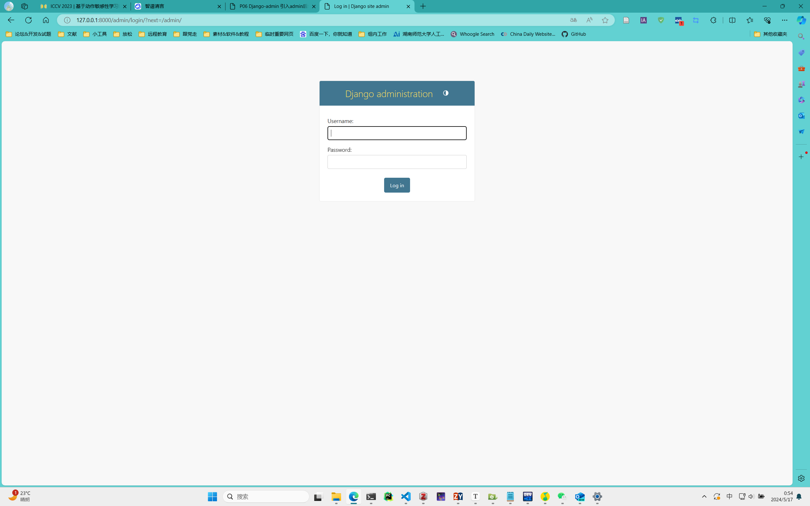
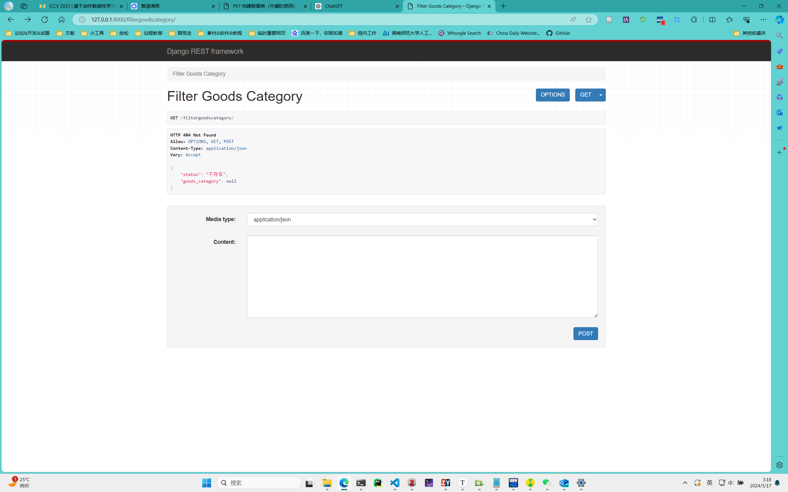

## Task2output

### 一、构建数据表

#### 1.1 常见问题

1. ##### models.py是什么？有啥用？

   在Django框架中，`models.py` 文件是用来定义**数据模型**的。数据模型代表了我们的应用程序使用的**数据结构**，它们与数据库中的表相对应，所以如果学习过数据库同学，其实不用解释，看到代码就知道干啥用的了。

   在这个文件中我们常会定义几个类，每个类代表1张表，比如学生信息表，工资发放表， 值班轮询表等等。

2. ##### 什么是数据模型？

   在 Django中，数据模型是一种用于表示和操作数据库中数据的**抽象层**。数据模型定义了**数据的结构**、**数据之间的关系**以及如何与数据库进行**交互**。

   数据模型由一系列的**类**组成，每个类对应到数据库中的一个**表**，类的属性映射到表的**列**。

   数据模型的主要特点包括：

   1. **字段（Fields）**：每个模型都是一系列字段的集合，每个字段都对应数据库表中的一个列。字段可以是不同的数据类型，如整数、字符串、日期等。
   2. **元数据（Metadata）**：模型还包括元数据，如数据库表名、人类可读的名称等。
   3. **关系（Relationships）**：模型可以定义与其他模型的关系，如一对一（OneToOneField）、一对多（ForeignKey）和多对多（ManyToManyField）关系。
   4. **操作（Operations）**：Django 提供了一套自动生成的数据库访问 API，允许我们通过模型进行创建、检索、更新和删除操作。
   5. **迁移（Migrations）**：Django 的迁移系统允许我们根据对模型的修改自动生成和应用数据库迁移，这使得管理数据库模式变得非常方便。

3. ##### 暂时想不到了😂

我们希望读者对教程中的步骤都是理解的，而不是机械对着髂代码，那样的学习是没有意义的。

因此，达到以上的目的，在正式构建数据表之前我们将介绍一些先验知识

#### 1.2 字段

每个模型都是一系列字段的集合，每个字段都对应数据库表中的一个**列**；字段可以是不同的数据类型，如整数、字符串、日期等。

| Field           | 用途                                                         |
| --------------- | ------------------------------------------------------------ |
| CharField       | 用于存储字符串类型，有最大长度限制                           |
| IntegerField    | 用于存储整数类型                                             |
| FloatField      | 用于存储浮点数类型                                           |
| BooleanField    | 用于存储布尔类型                                             |
| DateField       | 用于存储日期类型                                             |
| DateTimeField   | 用于存储日期和时间类型                                       |
| ImageField      | 用于存储图片类型                                             |
| FileField       | 用于存储文件类型                                             |
| ForeignKey      | 外键 用于表示数据库表之间的关联关系                          |
| OneToOneField   | 用于表示数据库表之间的一对一关系，比如用户表的用户名在用户详细信息表中有唯一的条目 |
| ManyToManyField | 多对多 用于表示数据库表之间多对多的关联关系，比如一个学生可以对应多个必须课程 |

#### 1.3 字段的可设置属性

| 选项         | 描述                                                         |
| ------------ | ------------------------------------------------------------ |
| primary_key  | 字段是否为主键，默认为 False。                               |
| max_length   | 字段的最大长度限制，可以应用于多种不同的字段类型。           |
| verbose_name | 字段的友好名称，在管理界面或数据库中代替原始字段的名称来显示。 |
| default      | 指定字段的默认值。                                           |
| null         | 指定字段是否可以为空。`null=True` 设置允许该字段为 NULL 值。 |
| blank        | 指定在表单中输入时是否可以为空白。                           |
| choices      | 用于指定字段的可选值枚举列表                                 |
| editable     | 是否可编辑，默认为True，表示字段在表单中可以编辑。           |
| unique       | 字段是否唯一，默认为 False。                                 |

#### 1.4 创建两个数据表

进入程序目录，打开models.py文件，然后创建两个数据表，代码如下：

```python
from django.db import models 


class GoodsCategory(models.Model):
    # 定义商品类别模型类
    name = models.CharField(max_length=64, verbose_name='名称')                             # 最大长度为64，网页显示为“备注”
    # 最大长度为256，可以为空值, 表单填写可以为空，网页显示为“备注”
    remark = models.CharField(max_length=256, null=True, blank=True, verbose_name='备注')


class Goods(models.Model):
    # 定义商品模型类
    number = models.CharField(max_length=32, verbose_name='编号')                           # 编号字段，最大长度为32，网页显示为“编号”
    name = models.CharField(max_length=64, verbose_name='名称')                             # 名称字段，最大长度为64，网页显示为“名称”
    barcode = models.CharField(max_length=32, null=True, blank=True, verbose_name='条码')   # 条码字段，最大长度为32，网页显示为“条码”
    # 外键字段，指向GoodsCategory表，一旦GoodsCategory中类别被删除，该表对应完成删除（级联删除），可以为空值
    # 这个参数定义了反向关系的名称。在 GoodsCategory 模型中，我们可以使用 category.goods_set 来获取属于该分类的所有商品。
    category = models.ForeignKey(to='GoodsCategory', on_delete=models.SET_NULL, null=True, related_name='goods_set', verbose_name='产品分类')
    # 规格字段，最大长度为64，可以为空，表单填写可以为空，网页显示为“规格”
    spec = models.CharField(max_length=64, null=True, blank=True, verbose_name='规格')
    purchase_price = models.FloatField(default=0, verbose_name='采购价')                     # 采购价格字段，默认值为0
    retail_price = models.FloatField(default=0, verbose_name='零售价')                       # 零售价格字段，默认值为0
    # 备注字段，最大长度为256，可以为空，表单填写可以为空，网页显示为“备注”
    remark = models.CharField(max_length=256, null=True, blank=True, verbose_name='备注')

```

有了先序知识，我相信此时代码看起来简直不要太简单。

如果上述代码有一个费解的参数，那可能是下面这一行

```python
category = models.ForeignKey(to='GoodsCategory', on_delete=models.SET_NULL, null=True, related_name='goods_set', verbose_name='产品分类')
```

这一行的【related_name='goods_set'】你是否看懂了呢？我想应该没有，它是用来设置一个反向关系，如果我们有一个商品类别的示例，我们可以用这个反向关系名字，获取该类别的所有商品信息，下面是参考代码：

```python
# category 是一个 GoodsCategory 实例
category = GoodsCategory.objects.get(name='电子产品')

# 获取属于这个类别的所有商品
goods = category.goods_set.all()

```

现在好理解多了吧！

#### 1.5 数据库更改与迁移

在**工程目录**下运行以下两条命令

```python
python manage.py makemigrations
```

这个命令的作用是检查我们的模型文件（ `models.py`），找出自从上次迁移以来模型文件发生的变化，比如添加了新的模型、字段或者修改了字段类型等，然后为这些变化创建一个新的迁移文件（存放在**程序目录**下的`migrations`子目录下）。

这个迁移文件是一个 Python 脚本，它包含了足够的信息来修改数据库，使其与模型保持一致。

```python
python manage.py migrate
```

这个命令则负责执行前面由【python manage.py makemigrations】 命令创建的迁移文件，将迁移应用到数据库中。

简单来说，就是根据迁移文件中的指示，对数据库进行更新，添加或删除表格、字段等，以匹配当前的模型结构，以让数据库和最新数据保持同步。

### 二、管理员的创建与登录

#### 2.1 创建管理员账户

在**工程目录**下运行如下命令

```cmd
python manage.py createsuperuser
```

上述命令解释为创建一个超级用户，即管理员，运行后回车会不断让我们输入一些必要的信息，读者俺引导便可完成操作，以下是一个示例：

```cmd
(erp_venv) D:\Software\HUNNU CloudDisk\Cache\彭彩平_1\我的资料库\开源助教\Django\MyFirstProject>python manage.py createsuperuser
Username: midsummer
Email address: 331XXX5430@qq.com        
Password:
Password (again):
Superuser created successfully.
```

其中，输入密码时，是不会显示密码的，注意别打错了。

#### 2.2 配置模型

进入**程序目录**下，打开`admin.py`,默认程序是空的如下所示：

```python
from django.contrib import admin

# Register your models here.
```

需要自己添加内容，操作是注册模型，既然是注册模型，那么就要导入和我们`admin.py`**程序目录**下的`models.py`模块，怎么导入，以及其含义均包含在代码注释中。

```python
from django.contrib import admin
from .models import *               # 从同级目录下导入models模块

# Register your models here.
admin.site.register(Goods)          # 注册Goods表
admin.site.register(GoodsCategory)  # 注册GoodsCategory表 
```

#### 2.3 管理员登录

首先，让控制台进入**工程目录**，然后运行启动服务的命令

```cmd
python manage.py runserver
```

下面是我的启动示例，下面会给出浏览器的访问地址

```cmd
(erp_venv) D:\Software\HUNNU CloudDisk\Cache\彭彩平_1\我的资料库\开源助教\Django\MyFirstProject>python manage.py runserver
Watching for file changes with StatReloader
Performing system checks...

System check identified no issues (0 silenced).
May 17, 2024 - 00:49:24
Django version 5.0.6, using settings 'MyFirstProject.settings'
Starting development server at http://127.0.0.1:8000/
Quit the server with CTRL-BREAK.
```

需要注意的是，之前我们都是访问站点的根目录，但是现在我们既然要登录管理员账户，就不能是访问根目录了，而是要访问管理员目录。

以上面输入内容为例，根目录访问地址：

```python
http://127.0.0.1:8000/
```

那么，管理员访问地址是如下地址：

```python
http://127.0.0.1:8000/admin
```

接着浏览器将挑战到登录界面，如下图所示：



输入用户名密码点击`Log in`即可进入管理员后台。

### 三、外键测试

#### 3.1 定义外键

如果你还记得的话，前面我们的`Goods`表是定义了外键的，如果不记得了，那就再看看吧：

```python
from django.db import models 


class GoodsCategory(models.Model):
    # 定义商品类别模型类
    name = models.CharField(max_length=64, verbose_name='名称')                             # 最大长度为64，网页显示为“备注”
    # 最大长度为256，可以为空值, 表单填写可以为空，网页显示为“备注”
    remark = models.CharField(max_length=256, null=True, blank=True, verbose_name='备注')


class Goods(models.Model):
    ···
    # 外键字段，指向GoodsCategory表，一旦GoodsCategory中类别被删除，该表对应完成删除（级联删除），可以为空值
    # 这个参数定义了反向关系的名称。在 GoodsCategory 模型中，我们可以使用 category.goods_set 来获取属于该分类的所有商品。
    category = models.ForeignKey(to='GoodsCategory', on_delete=models.SET_NULL, null=True, related_name='goods_set', verbose_name='产品分类')
    ···
```

#### 3.2 编写视图（View）

总所周知，程序必须要有输入和输出，那么下面我们将编写两个2个API，完成通过分类名字查询该分类所有对象的功能。

由于目前我的数据表还没有任何数据，因此就不存在任何数据处理了，API中实现了对POST和GET状态的反馈，后面我们可以通过网页看到实际效果。

```python
from django.shortcuts import render, get_object_or_404  
from rest_framework.response import Response 
from rest_framework.decorators import api_view 
from .models import GoodsCategory                   # 从当前应用的models模块中导入GoodsCategory模型

# Create your views here.  

# Insert or retrieve GoodsCategory  


@api_view(['POST', 'GET'])                          # 将InsertGoodsCategory函数声明为处理POST和GET请求的API视图
def InsertGoodsCategory(request):                   # 定义InsertGoodsCategory视图函数
    category_name = request.data.get('分类名字')    
    if not category_name:                        
        return Response({"error": "分类名字是必填项"}, status=400)  # 返回错误响应，状态码400
    # 获取分类对象或创建新的分类对象
    category, created = GoodsCategory.objects.get_or_create(name=category_name)  # 根据名字获取或创建GoodsCategory对象
    # 判断是否已存在分类
    if not created:  
        return Response({"status": "已存在", "goods_category": category_name}, status=200)  # 返回已存在的响应，状态码200
    else:  
        return Response({"message": f"Successfully inserted category '{category_name}'."})  # 返回成功插入的响应


@api_view(['POST', 'GET'])  
def FilterGoodsCategory(request): 
    data = request.data.get('分类名字') 
    goods = GoodsCategory.objects.filter(name=data)  # 过滤出名字为data的GoodsCategory对象
    if goods.exists():  # 如果存在符合条件的对象
        return Response({"status": "已存在", "goods_category": data}, status=200)  # 返回已存在的响应，状态码200
    else:  # 如果不存在符合条件的对象
        return Response({"status": "不存在", "goods_category": data}, status=404)  # 返回不存在的响应，状态码404

```

#### 3.3 页面访问

在工程目录下运行启动服务命令

```cmd
python manage.py runserver
```

然后会得到一个访问地址，比如我的是

```python
 http://127.0.0.1:8000/
```

若需要访问过滤商品的页面，则需要使用以下地址：

```python
 http://127.0.0.1:8000/filtergoodscategory/
```



若需要访问商品的页面，则需要使用以下地址：

```python
 http://127.0.0.1:8000/insertgoodscategory/
```

