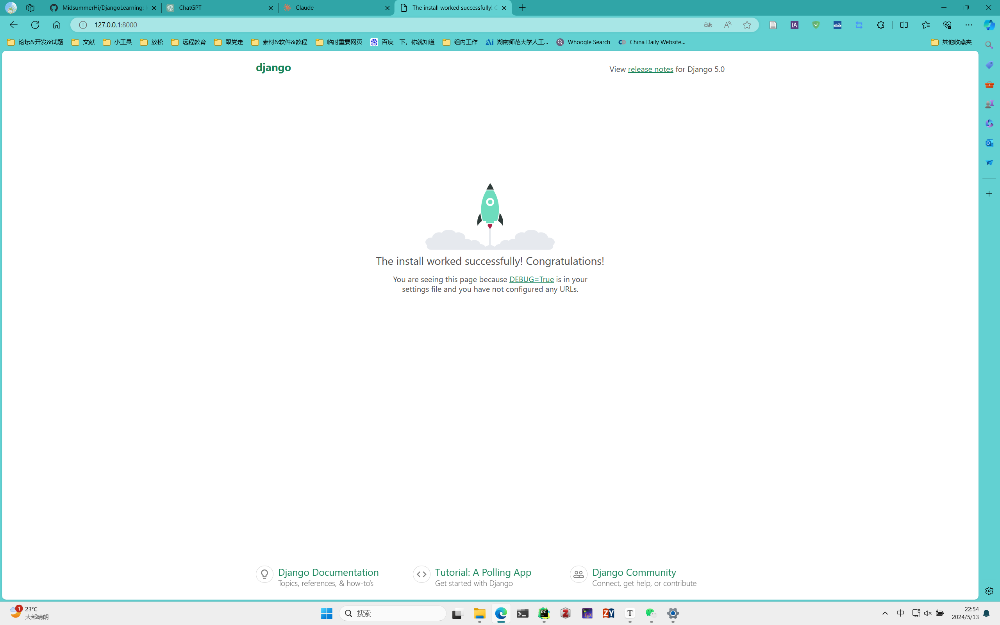

<center><h3>Datawhale组队学习-Django学习-task1学习输出</h3></center>

### 一、杂七杂八的规范

要做好一个项目，我们必须规范自己的开发行为，以下几点是正式开始前的一些习惯：

- 正式开发前，请为自己的工程创建一个工程目录，然后所有的工作在工程目录下完成
- 控制台的目录应该调整为工程目录
- 运行任何命令之前请确保自己处于正确的虚拟环境当中

请记住，以上并不是完全要求的，但是为了少给自己惹麻烦，还要多提醒自己做好规范操作。

### 二、 环境配置(以windows为例)

1. ##### 虚拟环境安装与激活

   首先运行如下命令，创建一个虚拟环境

   ```cmd
   conda create -n erp_venv python=3.11 -y
   ```

   以上命令中，参数`erp_venv`需更改为你自己喜欢命名，比如我的的环境名字就叫`erp_venv`；此外参数`python=3.11`是指定python的版本，读者可自行指定。⚠️建议版本不要太低，以免引起依赖包的安装失败。

   接着运行如下命令完成虚拟环境激活

   ```cmd
   conda activate erp_venv
   ```

2. ##### 依赖包安装

   - ##### 方法1

   Django目前所需要的所有依赖包，列出如下，可将其拷贝，直接复制到控制台中回车运行，即可完成安装（如果网络正确）

   ```cmd
   pip install django
   pip install djangorestframework
   pip install django-filter
   pip install drf_spectacular
   pip install django-debug-toolbar
   pip install django_extensions
   ```

   - ##### 方法2

   还有一种做法，将包名写到一个`txt`文件中，如下所示为该文件的内容:

   ```
   django 
   djangorestframework 
   django-filter 
   drf_spectacular 
   django-debug-toolbar 
   django_extensions
   ```

   并为其命名为`requirements.txt`，然后保存到控制台当前运行的目录下；接着运行如下命令，完成包的安装：

   ```cmd
   pip install -r requirements.txt
   ```

   目前对于我们这个小程序来说，看来比较麻烦，但对于依赖很多的程序来说，是一个很好的解决方案。

### 三、Django程序开发初试

1. ##### 程序工程目录和程序本身的创建

   - ##### 创建程序工程目录

     ```cmd
     django-admin startproject MyFirstProject
     ```

     以上命令，前两个字符串都属于固有命令字符串，该命令用于创建一个**工程目录**；`MyFirstProject`为要创建的工程目录名字，读者可自定义；

     创建完后，应该会生成一个名为MyFirstProject的文件夹，其内容如下目录树所示：

     ```cmd
     │  manage.py
     │
     └─MyFirstProject
             asgi.py
             settings.py
             urls.py
             wsgi.py
             __init__.py
     ```

     上述目录树的生成可在命令行进入对应目录后运行以下命令生成

     ```cmd
     tree /f
     ```

   - ##### 创建程序

     运行下面命令，进入**工程目录**

     ```cmd
     cd MyFirstProject
     ```

     然后用django提供的命令创建一个程序

     ```cmd
     django-admin startapp MyFirstAPP
     ```

     上述命令中，运行完后，将生成一个新的名为`MyFirstAPP`的文件夹，文件夹中包含程序正式开发前必须的一些初始化文件，再次在工程目录中运行`tree /f`将得到如下目录结构。

     ```cmd
     │  manage.py
     │
     ├─MyFirstApp
     │  │  admin.py
     │  │  apps.py
     │  │  models.py
     │  │  tests.py
     │  │  views.py
     │  │  __init__.py
     │  │
     │  └─migrations
     │          __init__.py
     │
     └─MyFirstProject
             asgi.py
             settings.py
             urls.py
             wsgi.py
             __init__.py
     ```

2. ##### 程序运行前参数调整

   1. 更新**程序目录**下的`apps.py`文件，以我为例

      - 文件原始内容

        ```python
        from django.apps import AppConfig
        
        class MyfirstappConfig(AppConfig):
            default_auto_field = "django.db.models.BigAutoField"
            name = "MyFirstApp"
        ```
        
   - 修改后
      
     ```cmd
        from django.apps import AppConfig
        
        class MyfirstappConfig(AppConfig):
            default_auto_field = "django.db.models.BigAutoField"
            name = "MyFirstProject.MyFirstApp"  # 修改为"工程目录名.程序目录名"的形式
        ```
      
   2. 设置**工程目录**下**子同名目录**（`MyFirstProject`）的`settings.py`文件

      - 文件内容某部分修改前

        ```python
     INSTALLED_APPS = [
            "django.contrib.admin",
            "django.contrib.auth",
            "django.contrib.contenttypes",
            "django.contrib.sessions",
            "django.contrib.messages",
            "django.contrib.staticfiles",
        ]
        ```
   
      - 修改后

        ```python
     INSTALLED_APPS = [
            "django.contrib.admin",
            "django.contrib.auth",
            "django.contrib.contenttypes",
            "django.contrib.sessions",
            "django.contrib.messages",
            "django.contrib.staticfiles",
            "MyFirstApp.tests",  # 新增，写成“主程序名.测试程序名”
            "rest_framework",  # 新增
            "django_filters",  # 新增
            "drf_spectacular",  # 新增
        ]
        ```
   
      其中【MyFirstApp.tests】这一个是将程序目录下的`tests`是程序包含进来，这个参数的格式为`<主程序名>.<测试程序名>`。

3. ##### 数据库迁移

   在**工程目录**（第一级MyFirstProject）下，运行如下命令完成数据库迁移

   ```cmd
   python manage.py makemigrations
   python manage.py migrate
   ```

   如果之前的步骤读者都跟着我做了，或者理解了我那些步骤的含义，上面的数据库迁移命令不会报错；如果某个地方没理解或者遇到细节问题（比如大小写错误），可能会导致报错。

   我举一个没理解写法的作用导致错误的例子，假设我把

   ```python
   "MyFirstApp.tests",  # 新增，写成“主程序名.测试程序名”
   ```

   改成

   ```python
   "MyFirstApp.data",  # 新增，写成“主程序名.测试程序名”
   ```

   ⚠️运行上述命令第一行会得到一个标准的模块找不到错误：

   ```cmd
   (erp_venv) PS D:\Software\HUNNU CloudDisk\Cache\彭彩平_1\我的资料库\开源助教\Django\MyFirstProject> python .\manage.py makemigrations
   Traceback (most recent call last):
     File "D:\Software\HUNNU CloudDisk\Cache\彭彩平_1\我的资料库\开源助教\Django\MyFirstProject\manage.py", line 22, in <module>
       main()
     File "D:\Software\HUNNU CloudDisk\Cache\彭彩平_1\我的资料库\开源助教\Django\MyFirstProject\manage.py", line 18, in main
       execute_from_command_line(sys.argv)
     File "D:\Anaconda\envs\erp_venv\Lib\site-packages\django\core\management\__init__.py", line 442, in execute_from_command_line
       utility.execute()
     File "D:\Anaconda\envs\erp_venv\Lib\site-packages\django\core\management\__init__.py", line 416, in execute
       django.setup()
     File "D:\Anaconda\envs\erp_venv\Lib\site-packages\django\__init__.py", line 24, in setup
       apps.populate(settings.INSTALLED_APPS)
     File "D:\Anaconda\envs\erp_venv\Lib\site-packages\django\apps\registry.py", line 91, in populate
       app_config = AppConfig.create(entry)
                    ^^^^^^^^^^^^^^^^^^^^^^^
     File "D:\Anaconda\envs\erp_venv\Lib\site-packages\django\apps\config.py", line 193, in create
       import_module(entry)
     File "D:\Anaconda\envs\erp_venv\Lib\importlib\__init__.py", line 126, in import_module
       return _bootstrap._gcd_import(name[level:], package, level)
              ^^^^^^^^^^^^^^^^^^^^^^^^^^^^^^^^^^^^^^^^^^^^^^^^^^^^
     File "<frozen importlib._bootstrap>", line 1204, in _gcd_import
     File "<frozen importlib._bootstrap>", line 1176, in _find_and_load
     File "<frozen importlib._bootstrap>", line 1140, in _find_and_load_unlocked
   ModuleNotFoundError: No module named 'MyFirstApp.data'
   ```

   最终错误源便可发现是第二部分参数调整时，`setting`文件里添加的下面这一行不对

   ```python
   "MyFirstApp.data",  # 新增
   ```

   因为我们的测试程序叫`tests`，而不是`data`，记住😡一定要写成`<主程序名>.<测试程序名>`的形式。

4. ##### 启动程序

   工程目录下运行以下命令，开始运行程序

   ```cmd
   python manage.py runserver
   ```

   然后会得到一个和如下内容相差无几的控制台输出：

   ```cmd
   (erp_venv) PS D:\Software\HUNNU CloudDisk\Cache\彭彩平_1\我的资料库\开源助教\Django\MyFirstProject> python manage.py runserver
   Watching for file changes with StatReloader
   Performing system checks...
   
   System check identified no issues (0 silenced).
   May 13, 2024 - 22:50:59
   Django version 5.0.6, using settings 'MyFirstProject.settings'
   Starting development server at http://127.0.0.1:8000/
   Quit the server with CTRL-BREAK.
   ```

   接着你就可以使用`http://127.0.0.1:8000/`粘贴到浏览器的地址栏回车访问你的网站了，这个地址不一定和我相同，得看系统端口占用情况，因此不要直接拷贝我的地址，而是拷贝你的控制台输出中给的地址。

   以下是访问样例：

   

### 四、聊聊

今天和我的同学聊到了音视频开发的大牛[雷霄骅_百度百科 (baidu.com)](https://baike.baidu.com/item/雷霄骅/19871999)，我们这些技术人员都尊称他为雷神。为什么这么称呼呢？我想应该有如下几点原因：

- 他很厉害，26岁可以说音视频开发已经炉火纯青了，在那个工具不像现在这么发达的年代，能够对如此难（大家可以了解一下音视频深度开发的难度，尤其是它对各种开发的低层代码都逐行读通，并能通俗地讲出来）的音视频开发做到如此牛，便使人对他心生尊敬。

  这是它的博客，大家可以看看：[雷霄骅-CSDN博客](https://blog.csdn.net/leixiaohua1020)

- 他的开源精神值得大家尊敬：对于音视频开发这种高难度的东西，很多人学会了就藏着掖着，丝毫不愿意传授给他人；而他将所有心血都写成了质量超高的博客，甚至写成了完整的从入门到精通的可成书的教程，他将这些都全部开源在了csdn。这些教程的价值甚至远超那些付费课程。

  借此，我也向表达一下我的意见，我是拥抱开源的，开源才能更好地促进快速迭代和优化；自己写的东西不开源，依赖自己的力量一旦不更新了，也就成了屎山；最初linux是不开源的，正是有了开源，linux才会发展到今天；

  现在一些同学写博客，虽然我很理解他们珍惜自己劳动成果的想法；但是写的很拉，然后开付费专栏这就不应该了，当然这是他们的自由。

- 他26岁猝死在了中国传媒大学的的实验室，当时他在读博士；这样一个人，如此高尚的开源精神，却遭到老天嫉妒，真是可惜；他对技术的热爱，让人们再次对其升起崇高的敬意

雷神已逝，但精神用在，看到我本文的读者，不知你们如何看待开源。