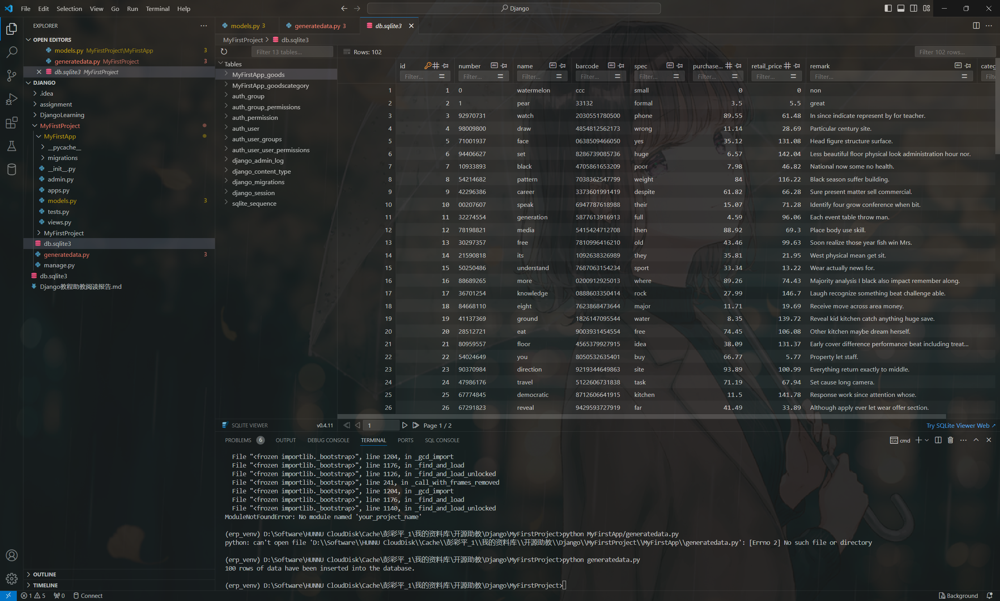

<center><h3>task3output</h3></center>

### 3.1 QuerySet

Django 的 ORM（Object-Relational Mapping，对象-关系映射）能够让你使用Python（或其他编程语言）来操作数据库，就像你在操作Python对象一样。

从数据库中查询出来的结果一般是一个集合，这个集合叫做 QuerySet。

#### 3.1.1 用代码往数据库中先随机写入一些数据

激活虚拟环境后，我们来安装faker库，它可以生成一些随机的文本

```python
pip install faker
```

请在工程目录下创建一个`generate.py`文件，然后将以下内容拷贝至文件中

```python
import os
import django
import random
from faker import Faker

# 设置 Django 项目的环境变量
os.environ.setdefault('DJANGO_SETTINGS_MODULE', 'MyFirstProject.settings')
django.setup()

# 导入模型
from MyFirstApp.models import GoodsCategory, Goods

# 初始化 Faker
fake = Faker()

# 创建类别
categories = []
for _ in range(5):
    category_name = fake.word()         # 生成一个随机单词作为类别名称
    category_remark = fake.sentence()   # 生成一个随机句子作为类别备注
    category = GoodsCategory.objects.create(name=category_name, remark=category_remark)  # 创建商品类别对象并保存到数据库
    categories.append(category)  # 将创建的类别添加到列表中

# 创建商品
for _ in range(100):
    number = fake.ean8()                # 生成一个随机EAN-8编号
    name = fake.word()                  # 生成一个随机单词作为商品名称
    barcode = fake.ean13()              # 生成一个随机EAN-13条形码
    spec = fake.word()                  # 生成一个随机单词作为商品规格
    purchase_price = round(random.uniform(1.0, 100.0), 2)       # 生成一个1.0到100.0之间的随机浮点数，并保留两位小数作为采购价格
    retail_price = round(random.uniform(1.0, 150.0), 2)         # 生成一个1.0到150.0之间的随机浮点数，并保留两位小数作为零售价格
    remark = fake.sentence()                                    # 生成一个随机句子作为商品备注
    category = random.choice(categories)                        # 从已创建的类别中随机选择一个作为商品的类别

    Goods.objects.create(  # 创建商品对象并保存到数据库
        number=number,
        name=name,
        barcode=barcode,
        spec=spec,
        purchase_price=purchase_price,
        retail_price=retail_price,
        remark=remark,
        category=category
    )

print("100 rows of data have been inserted into the database.")  # 打印提示信息，表示数据已插入数据库

```

运行代码

```python
python generate.py
```

然后出现提示，100行数据写完了，那么我们打开数据库（如果你用vscode编辑代码，可以安装sqlite插件）可以看到数据库中增加了一百条新数据



#### 3.1.2 QuerySet常见API

我们查询数据或者操作数据都需要借助一些封装好的API函数来进行，人工是无法完成的（我们不知道别人程序的低层逻辑，同时也无法访问低层）。

以下是一些常见的API，我们对其功能做了简单的描述，具体细节我们在后面测试部分来进行演示。

| 方法名           | 描述                                                         |
| ---------------- | ------------------------------------------------------------ |
| all()            | 返回模型的所有对象                                           |
| filter(**kwargs) | 用于返回符合条件的所有数据，该方法接受许多参数，这里不例举，读者自行查询 |
| get()            | 方法与 filter() 的作用类似，用于返回符合条件的单个对象，但是当返回多个值时会抛出异常 |
| delete()         | 可以删除符合条件的所有对象                                   |
| update()         | 将符合条件的所有对象的某个字段值进行更新                     |
| create()         | 是 save() 方法的快捷方式，用于创建并保存一个新的对象         |
| count()          | 返回符合条件的对象数量                                       |
| order_by()       | 对返回的对象进行排序，默认为升序。降序则在字段名前面加负号   |
| values()         | 用来指定提取的数据中需要提取哪些字段                         |

以上所有API都将以如下形式使用：

```python
数据模型名.objects.方法
```

#### 3.1.3 QuerySet常见操作演示

使用快捷键【Ctrl+`】打开控制台，如果已打开就当我没说hh，然后进入**工程目录**，输入以下命令，进入django的shell模式：

```python
python manage.py shell
```

然后导入我们的**数据模型**模块

```python
from MyFirstApp.models import *
```

接着，我们来完成上述一系列操作

- ##### 返回数据库的所有对象

```cmd
>>> GoodsCategory.objects.all()
<QuerySet [<GoodsCategory: fruit>, <GoodsCategory: collection>, <GoodsCategory: drive>, <GoodsCategory: item>, <GoodsCategory: place>, <GoodsCategory: into>]>
```

```cmd
>>> Goods.objects.all()
<QuerySet [<Goods: watermelon>, <Goods: pear>, <Goods: watch>, <Goods: draw>, <Goods: face>, <Goods: set>, <Goods: black>, <Goods: pattern>, <Goods: career>, <Goods: speak>, <Goods: generation>, <Goods: media>, <Goods: free>, <Goods: its>, <Goods: understand>, <Goods: more>, <Goods: knowledge>, <Goods: eight>, <Goods: ground>, <Goods: eat>, '...(remaining elements truncated)...']>
```

- ##### 返回每个数据库表项的详细信息

```cmd
>>> GoodsCategory.objects.values()
<QuerySet [{'id': 1, 'name': 'fruit', 'remark': 'test'}, {'id': 2, 'name': 'collection', 'remark': 'Miss international local.'}, {'id': 3, 'name': 'drive', 'remark': 'Wonder although lay.'}, {'id': 4, 'name': 'item', 'remark': 'Right bad him surface sing picture our bank.'}, {'id': 5, 'name': 'place', 'remark': 'Member because item peace.'}, {'id': 6, 'name': 'into', 'remark': 'Man view first trouble child dark.'}]>
```

```cmd
>>> Goods.objects.values()         
<QuerySet [{'id': 1, 'number': '0', 'name': 'watermelon', 'barcode': 'ccc', 'category_id': None, 'spec': 'small', 'purchase_price': 0.0, 'retail_price': 0.0, 'remark': 'non'}, {'id': 2, 'number': '1', 'name': 'pear', 'barcode': '33132', 'category_id': 1, 'spec': 'formal', 'purchase_price': 3.5, 'retail_price': 5.5, 'remark': 'great'}, {'id': 3, 'number': '92970731', 'name': 'watch', 'barcode': '2030551780500', 'category_id': 3, 'spec': 'phone', 'purchase_price': 89.55, 'retail_price': 61.48, 'remark': 'In since indicate represent by for teacher.'}, {'id': 4, 'number': '98009800', 'name': 'draw', 'barcode': '4854812562173', 'category_id': 4, 'spec': 'wrong', 'purchase_price': 11.14, 'retail_price': 28.69, 'remark': 'Particular century site.'}, {'id': 5, 'number': '71001937', 'name': 'face', 'barcode': '0638509466050', 'category_id': 3, 'spec': 'yes', 'purchase_price': 35.12, 'retail_price': 131.08, 'remark': 'Head figure structure surface.'}, {'id': 6, 'number': '94406627', 'name': 'set', 'barcode': '8286739085736', 'category_id': 5, 'spec': 'huge', 'purchase_price': 6.57, 'retail_price': 142.04, 'remark': 'Less beautiful floor physical look administration hour nor.'}, {'id': 7, 'number': '10933893', 'name': 'black', 'barcode': '4705861653209', 'category_id': 6, 'spec': 'poor', 'purchase_price': 7.98, 'retail_price': 46.82, 'remark': 'National now some no health.'}, {'id': 8, 'number': '54214682', 'name': 'pattern', 'barcode': '7038362547799', 'category_id': 4, 'spec': 'weight', 'purchase_price': 84.0, 'retail_price': 116.22, 'remark': 'Black season suffer building.'}, {'id': 9, 'number': '42296386', 'name': 'career', 'barcode': '3373601991419', 'category_id': 3, 'spec': 'despite', 'purchase_price': 61.82, 'retail_price': 66.28, 'remark': 'Sure present matter sell commercial.'}, {'id': 10, 'number': '00207607', 'name': 'speak', 'barcode': '6947787618988', 'category_id': 2, 'spec': 'their', 'purchase_price': 15.07, 'retail_price': 71.28, 'remark': 'Identify four grow conference when bit.'}, {'id': 11, 'number': '32274554', 'name': 'generation', 'barcode': '5877613916913', 'category_id': 2, 'spec': 'full', 'purchase_price': 4.59, 'retail_price': 96.06, 'remark': 'Each event table throw man.'}, {'id': 12, 'number': '78198821', 'name': 'media', 'barcode': '5415424712708', 'category_id': 5, 'spec': 'then', 'purchase_price': 88.92, 'retail_price': 69.3, 'remark': 'Place body use skill.'}, {'id': 13, 'number': '30297357', 'name': 'free', 'barcode': '7810996416210', 'category_id': 4, 'spec': 'old', 'purchase_price': 43.46, 'retail_price': 99.63, 'remark': 'Soon realize those year fish win Mrs.'}, {'id': 14, 'number': '21590818', 'name': 'its', 'barcode': '1092638326989', 'category_id': 6, 'spec': 'they', 'purchase_price': 35.81, 'retail_price': 21.95, 'remark': 'West physical mean get sit.'}, {'id': 15, 'number': '50250486', 'name': 'understand', 'barcode': '7687063154234', 'category_id': 3, 'spec': 'sport', 'purchase_price': 33.34, 'retail_price': 13.22, 'remark': 'Wear actually news for.'}, {'id': 16, 'number': '88689265', 'name': 'more', 'barcode': '0200912925013', 'category_id': 6, 'spec': 'where', 'purchase_price': 89.26, 'retail_price': 74.43, 'remark': 'Majority analysis I black also impact remember along.'}, {'id': 17, 'number': '36701254', 'name': 'knowledge', 'barcode': '0888603350414', 'category_id': 5, 'spec': 'rock', 'purchase_price': 27.99, 'retail_price': 146.7, 'remark': 'Laugh recognize something beat challenge able.'}, {'id': 18, 'number': '84668110', 'name': 'eight', 'barcode': '7623868473644', 'category_id': 3, 'spec': 'major', 'purchase_price': 11.71, 'retail_price': 19.69, 'remark': 'Receive move across area money.'}, {'id': 19, 'number': '41137369', 'name': 'ground', 'barcode': '1826147095544', 'category_id': 4, 'spec': 'water', 'purchase_price': 8.35, 'retail_price': 139.72, 'remark': 'Reveal kid kitchen catch anything huge save.'}, {'id': 20, 'number': '28512721', 'name': 'eat', 'barcode': '9003931454554', 'category_id': 3, 'spec': 'free', 'purchase_price': 74.45, 'retail_price': 106.08, 'remark': 'Other kitchen maybe dream herself.'}, '...(remaining elements truncated)...']>
```

- ##### 计算数据库中有多少表项（数据对象）

```cmd
>>> GoodsCategory.objects.values().count()
6
```

```cmd
>>> Goods.objects.values().count()
102
```

- ##### 筛选符合条件的对象

下面举出几个例子，筛选的条件都在filter方法的括号里指出了，如无特殊说明，我们的限制都作用在某一个域（字段）上


```python
>>> GoodsCategory.objects.values().filter(remark=None)
<QuerySet []>
```

```python
>>> Goods.objects.values('number', 'name', 'retail_price').filter(number__gt=2)
<QuerySet [{'number': '92970731', 'name': 'watch', 'retail_price': 61.48}, {'number': '98009800', 'name': 'draw', 'retail_price': 28.69}, {'number': '71001937', 'name': 'face', 'retail_price': 131.08}, {'number': '94406627', 'name': 'set', 'retail_price': 142.04}, {'number': '54214682', 'name': 'pattern', 'retail_price': 116.22}, {'number': '42296386', 'name': 'career', 'retail_price': 66.28}, {'number': '32274554', 'name': 'generation', 'retail_price': 96.06}, {'number': '78198821', 'name': 'media', 'retail_price': 69.3}, {'number': '30297357', 'name': 'free', 'retail_price': 99.63}, {'number': '21590818', 'name': 'its', 'retail_price': 21.95}, {'number': '50250486', 'name': 'understand', 'retail_price': 13.22}, {'number': '88689265', 'name': 'more', 'retail_price': 74.43}, {'number': '36701254', 'name': 'knowledge', 'retail_price': 146.7}, {'number': '84668110', 'name': 'eight', 'retail_price': 19.69}, {'number': '41137369', 'name': 'ground', 'retail_price': 139.72}, {'number': '28512721', 'name': 'eat', 'retail_price': 106.08}, {'number': '80959557', 'name': 'floor', 'retail_price': 131.37}, {'number': '54024649', 'name': 'you', 'retail_price': 5.77}, {'number': '90370984', 'name': 'direction', 'retail_price': 100.99}, {'number': '47986176', 'name': 'travel', 'retail_price': 67.94}, '...(remaining elements truncated)...']>
```

```python
>>> Goods.objects.values('number', 'name', 'retail_price').filter(number__gt=1, retail_price__lt=150)
<QuerySet [{'number': '92970731', 'name': 'watch', 'retail_price': 61.48}, {'number': '98009800', 'name': 'draw', 'retail_price': 28.69}, {'number': '71001937', 'name': 'face', 'retail_price': 131.08}, {'number': '94406627', 'name': 'set', 'retail_price': 142.04}, {'number': '10933893', 'name': 'black', 'retail_price': 46.82}, {'number': '54214682', 'name': 'pattern', 'retail_price': 116.22}, {'number': '42296386', 'name': 'career', 'retail_price': 66.28}, {'number': '32274554', 'name': 'generation', 'retail_price': 96.06}, {'number': '78198821', 'name': 'media', 'retail_price': 69.3}, {'number': '30297357', 'name': 'free', 'retail_price': 99.63}, {'number': '21590818', 'name': 'its', 'retail_price': 21.95}, {'number': '50250486', 'name': 'understand', 'retail_price': 13.22}, {'number': '88689265', 'name': 'more', 'retail_price': 74.43}, {'number': '36701254', 'name': 'knowledge', 'retail_price': 146.7}, {'number': '84668110', 'name': 'eight', 'retail_price': 19.69}, {'number': '41137369', 'name': 'ground', 'retail_price': 139.72}, {'number': '28512721', 'name': 'eat', 'retail_price': 106.08}, {'number': '80959557', 'name': 'floor', 'retail_price': 131.37}, {'number': '54024649', 'name': 'you', 'retail_price': 5.77}, {'number': '90370984', 'name': 'direction', 'retail_price': 100.99}, '...(remaining elements truncated)...']>
```

在上述的筛选条件中，我们注意到【filter(number\__gt=1, retail_price__lt=150)】，这里读者可能不太明白是什么含义。这个过滤器要求字段$\text{number}\ge1$，字段 $\text{retail\_price}\le1$.

其实也挺好理解或者说记忆**：gt=greater than；lt=less than**。


- ##### 排除符合条件的对象

```python
>>> GoodsCategory.objects.values().exclude(remark=None)
<QuerySet [{'id': 1, 'name': 'fruit', 'remark': 'test'}, {'id': 2, 'name': 'collection', 'remark': 'Miss international local.'}, {'id': 3, 'name': 'drive', 'remark': 'Wonder although lay.'}, {'id': 4, 'name': 'item', 'remark': 'Right bad him surface sing picture our bank.'}, {'id': 5, 'name': 'place', 'remark': 'Member because item peace.'}, {'id': 6, 'name': 'into', 'remark': 'Man view first trouble child dark.'}]>
```

- ##### 修改数据并保存

```python
>>> GoodsCategory.objects.filter(id=5).update(remark='眼镜')  
1
>>> GoodsCategory.objects.values().filter(id=5)  
<QuerySet [{'id': 5, 'name': 'place', 'remark': '眼镜'}]>
```

- ##### 删除对象

```python
>>> GoodsCategory.objects.all()
<QuerySet [<GoodsCategory: fruit>, <GoodsCategory: collection>, <GoodsCategory: drive>, <GoodsCategory: item>, <GoodsCategory: place>, <GoodsCategory: into>]>
>>> GoodsCategory.objects.filter(name='fruit').delete()
(1, {'MyFirstApp.GoodsCategory': 1})
>>> GoodsCategory.objects.all()
<QuerySet [<GoodsCategory: collection>, <GoodsCategory: drive>, <GoodsCategory: item>, <GoodsCategory: place>, <GoodsCategory: into>]>
```

从上面控制台返回的结果可以看出，`fruit`类确实被我们删除了。

- ##### 对筛选结果排序

升序排序（默认）

```cmd
>>> Goods.objects.values('number', 'name', 'retail_price').order_by('retail_price')
<QuerySet [{'number': '0', 'name': 'watermelon', 'retail_price': 0.0}, {'number': '52482038', 'name': 'most', 'retail_price': 2.03}, {'number': '92104228', 'name': 'animal', 'retail_price': 4.72}, {'number': '1', 'name': 'pear', 'retail_price': 5.5}, {'number': '54024649', 'name': 'you', 'retail_price': 5.77}, {'number': '13155889', 'name': 'those', 'retail_price': 6.59}, {'number': '83601217', 'name': 'defense', 'retail_price': 10.03}, {'number': '08291394', 'name': 'major', 'retail_price': 11.06}, {'number': '50250486', 'name': 'understand', 'retail_price': 13.22}, {'number': '38195617', 'name': 'force', 'retail_price': 17.37}, {'number': '15618573', 'name': 'statement', 'retail_price': 17.96}, {'number': '05837410', 'name': 'claim', 'retail_price': 18.58}, {'number': '84668110', 'name': 'eight', 'retail_price': 19.69}, {'number': '21590818', 'name': 'its', 'retail_price': 21.95}, {'number': '09101067', 'name': 'local', 'retail_price': 25.24}, {'number': '64910178', 'name': 'over', 'retail_price': 27.07}, {'number': '98009800', 'name': 'draw', 'retail_price': 28.69}, {'number': '57869650', 'name': 'too', 'retail_price': 33.52}, {'number': '67291823', 'name': 'reveal', 'retail_price': 33.89}, {'number': '19152271', 'name': 'million', 'retail_price': 33.97}, '...(remaining elements truncated)...']>
```

降序排序，只需要在字段前加一个前缀短横线【-】即可

```cmd
>>> Goods.objects.values('number', 'name', 'retail_price').order_by('-retail_price')
<QuerySet [{'number': '28819622', 'name': 'west', 'retail_price': 149.94}, {'number': '07335136', 'name': 'play', 'retail_price': 149.26}, {'number': '17217675', 'name': 'cover', 'retail_price': 148.54}, {'number': '36701254', 'name': 'knowledge', 'retail_price': 146.7}, {'number': '49278118', 'name': 'hour', 'retail_price': 144.41}, {'number': '68399764', 'name': 'show', 'retail_price': 142.24}, {'number': '94406627', 'name': 'set', 'retail_price': 142.04}, {'number': '67774845', 'name': 'democratic', 'retail_price': 141.78}, {'number': '62424059', 'name': 'early', 'retail_price': 141.4}, {'number': '57385518', 'name': 'hot', 'retail_price': 141.04}, {'number': '44821883', 'name': 'yet', 'retail_price': 140.38}, {'number': '03238622', 'name': 'thank', 'retail_price': 140.06}, {'number': '41137369', 'name': 'ground', 'retail_price': 139.72}, {'number': '51498498', 'name': 'role', 'retail_price': 135.85}, {'number': '13683207', 'name': 'billion', 'retail_price': 134.38}, {'number': '80959557', 'name': 'floor', 'retail_price': 131.37}, {'number': '71001937', 'name': 'face', 'retail_price': 131.08}, {'number': '89891315', 'name': 'level', 'retail_price': 129.51}, {'number': '73685609', 'name': 'top', 'retail_price': 129.42}, {'number': '60376466', 'name': 'mother', 'retail_price': 127.62}, '...(remaining elements truncated)...']>
```

#### 3.1.4 对象的操作

- ##### 指定一个对象

```cmd
>>> Goods.objects.all()
<QuerySet [<Goods: watermelon>, <Goods: pear>, <Goods: watch>, <Goods: draw>, <Goods: face>, <Goods: set>, <Goods: black>, <Goods: pattern>, <Goods: career>, <Goods: speak>, <Goods: generation>, <Goods: media>, <Goods: free>, <Goods: its>, <Goods: understand>, <Goods: more>, <Goods: knowledge>, <Goods: eight>, <Goods: ground>, <Goods: eat>, '...(remaining elements truncated)...']>
>>> Goods.objects.get(name='pear')  
<Goods: pear>
>>> Goods.objects.values().get(name='pear')    
{'id': 2, 'number': '1', 'name': 'pear', 'barcode': '33132', 'category_id': None, 'spec': 'formal', 'purchase_price': 3.5, 'retail_price': 5.5, 'remark': 'great'}
```

- ##### 修改一个对象

```cmd
>>> obj = Goods.objects.get(name='pear') 
>>> obj.purchase_price = 4.0
>>> obj.retail_price = 6.0
>>> obj.remark = '水果'
>>> obj.save()
>>> Goods.objects.values().get(name='pear') 
{'id': 2, 'number': '1', 'name': 'pear', 'barcode': '33132', 'category_id': None, 'spec': 'formal', 'purchase_price': 4.0, 'retail_price': 6.0, 'remark': '水果'}
```

- ##### 删除一个对象

```cmd
>>> Goods.objects.values()         
<QuerySet [{'id': 1, 'number': '0', 'name': 'watermelon', 'barcode': 'ccc', 'category_id': None, 'spec': 'small', 'purchase_price': 0.0, 'retail_price': 0.0, 'remark': 'non'},, '...(remaining elements truncated)...']>
>>> obj2 = Goods.objects.get(id=1)          
>>> obj2
<Goods: watermelon>
>>> obj2.delete()
(1, {'MyFirstApp.Goods': 1})
>>> Goods.objects.values()
<QuerySet [{'id': 2, 'number': '1', 'name': 'pear', 'barcode': '33132', 'category_id': None, 'spec': 'formal', 'purchase_price': 4.0, 'retail_price': 6.0, 'remark': '水果'}, '...(remaining elements truncated)...']>
```

### 3.2 APIView

#### 3.2.1 什么是APIView

APIview 是 Django REST Framework 提供的一个视图类。它和 Django 中的 view 类有些相似，但是又有一些不同之处。APIview 可以处理基于 HTTP 协议的请求，并返回基于内容协商的响应，它旨在提供一个易于使用且灵活的方式来构建 API 视图。

#### 3.2.2 APIView测试

进入**程序目录**下，修改`views.py`文件，粘贴以下内容：

```python
# 面向对象编程
from django.shortcuts import render
from rest_framework.decorators import api_view
from .models import *
from rest_framework.response import Response
from rest_framework.views import APIView
#### APIView
 class GetGoods(APIView):
     def get(self, request):
         data = Goods.objects.all()
         serializer = GoodsSerializer(instance=data, many=True)
         print(serializer.data)
         return Response(serializer.data)

     def post(self, request):
         # 从请求数据中提取字段
         request_data = {
             "category": request.data.get("Goodscategory"),
             "number": request.data.get("number"),
             "name": request.data.get("name"),
             "barcode": request.data.get("barcode"),
             "spec": request.data.get("spec"),
             "shelf_life_days": request.data.get("shelf_life_days"),
             "purchase_price": request.data.get("purchase_price"),
             "retail_price": request.data.get("retail_price"),
             "remark": request.data.get("remark"),
         }

         # 使用 create() 方法创建新的商品对象
         new_goods = Goods.objects.create(**request_data)

         # 对创建的对象进行序列化，并作为响应返回
         serializer = GoodsSerializer(instance=new_goods)
         return Response(serializer.data)


 # 面向对象编程
 class FilterGoodsCategoryAPI(APIView):
     # request 表示当前的请求对象
     # self 表示当前实例对象

     def get(self, request, format=None):
         print(request.method)
         return Response('ok')

     def post(self, request, format=None):
         print(request.method)
         return Response('ok')

     def put(self, request, format=None):
         print(request.method)
         return Response('ok')

```

对应的要修改url，则定位到工程目录下同名字文件夹内的urls.py，粘贴以下内容

```python
from django.contrib import admin
from django.urls import path
from MyFirstApp.views import *

urlpatterns = [
    path('admin/', admin.site.urls),
    path('filtergoodscategoryapi/', FilterGoodsCategoryAPI.as_view()),
    path('getgoods/', GetGoods.as_view()),
]

```

然后即可启动服务，在浏览器端查看了。